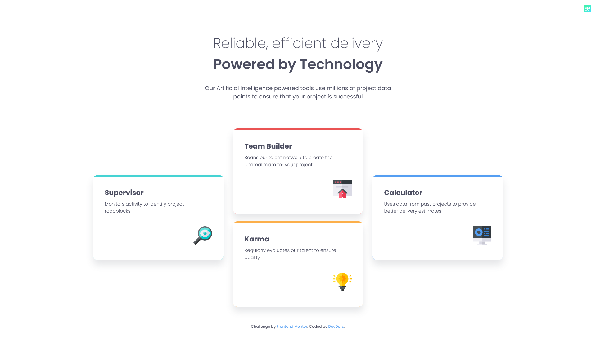

# Frontend Mentor - Four card feature section solution

This is a solution to the [Four card feature section challenge on Frontend Mentor](https://www.frontendmentor.io/challenges/four-card-feature-section-weK1eFYK).

## Table of contents

- [Overview](#overview)
  - [The challenge](#the-challenge)
  - [Screenshot](#screenshot)
  - [Links](#links)
- [My process](#my-process)
  - [Built with](#built-with)
  - [What I learned](#what-i-learned)
  - [Continued development](#continued-development)
  - [Useful resources](#useful-resources)
- [Author](#author)

## Overview

### The challenge

Users should be able to:

- View the optimal layout for the site depending on their device's screen size

### Screenshot

### Links

- Solution URL: [Click here](https://github.com/DevvMarko/Four-Card-Section)
- Live Site URL: [Click here](https://four-card-section-jade.vercel.app/)

## My process

### Built with

- Semantic HTML5 markup
- CSS custom properties
- Flexbox
- CSS Grid
- SASS

### What I learned

Using SASS to style my site made my job a lot easier. I also used a CSS grid for the first time where I had trouble with the spacing between the cards in the center column, but I used a CSS grid generator and fixed my problem.

### Continued development

In the next project we will use Bootstrap to create an easier and faster responsive website.

### Useful resources

- [CSS Grid Generator](https://cssgrid-generator.netlify.app/) - This helped me for resolve me Grid problem.

## Author
- Frontend Mentor - [@DevDaru](https://www.frontendmentor.io/profile/DevvMarko)
